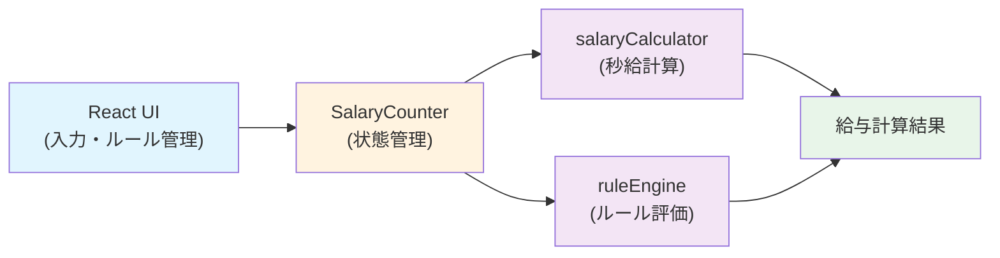

# Design: 秒給与動的計算モデル

## 概要

秒給動的計算を実現するため、給与計算ロジック（Domain）とルール管理（Application）を分離し、複数ルール複合時の優先度制御を独立した関数として実装する。

---

## アーキテクチャ

```
┌─────────────────────────────────────────────┐
│       SalaryCounterComponent (React)        │
│  - 入力フォーム（月給、月勤務、給与日）  │
│  - ルール管理UI                        │
│  - 秒給・累計給与表示                  │
└────────────┬────────────────────────────────┘
             │
             ↓
┌─────────────────────────────────────────────┐
│    SalaryCounter (State Management)         │
│  - 時刻追跡、累計給与管理              │
│  - ルール評価                          │
│  - advanceSeconds() → 秒給再計算       │
└────────────┬────────────────────────────────┘
             │
             ↓
┌─────────────────────────────────────────────┐
│    給与計算エンジン (Domain)                │
│  ┌──────────────────────────────────────┐  │
│  │ salaryCalculator.ts                  │  │
│  │ - calculateSecondSalary()            │  │
│  │   (動的計算: 受取額÷勤務秒)       │  │
│  │ - calculateOvertimeSalary()          │  │
│  │   (残業代計算)                    │  │
│  └──────────────────────────────────────┘  │
│  ┌──────────────────────────────────────┐  │
│  │ ruleEngine.ts (新)                   │  │
│  │ - evaluateRules(time, rules)         │  │
│  │   → マッチしたルール決定              │
│  │ - applyPriority(matchedRules)        │  │
│  │   → 優先度に基づき倍率決定           │  │
│  └──────────────────────────────────────┘  │
└─────────────────────────────────────────────┘
```

---

## コンポーネント設計

### 1. salaryCalculator.ts（拡張）

**責務**: 秒単位の給与計算

#### 関数: `calculateSecondSalary()`

**変更前**（秒給固定）:
```typescript
calculateSecondSalary(monthlySalary, monthlyWorkingHours, fixedWorkingHours?)
→ monthlySalary / (divisorHours * 3600)
```

**変更後**（動的計算）:
```typescript
calculateSecondSalary(params: {
  monthlySalary: number;
  actualWorkingSeconds: number;      // 月初からの実勤務秒数
  remainingWorkingSeconds: number;   // 給与日までの残り予定秒数
  totalSalary: number;               // 月給 + 発生した残業代
})
→ totalSalary / (actualWorkingSeconds + remainingWorkingSeconds)
```

#### 新関数: `calculateOvertimeSalary()`

見なし超過 / 時間外の残業代を計算

```typescript
calculateOvertimeSalary(params: {
  monthlySalary: number;
  monthlyWorkingHours: number;       // 160h 等
  actualWorkingHours: number;        // 実勤務時間
  assumedWorkingHours?: number;      // 見なし時間
  appliedRules: Rule[];              // マッチしたルール
})
→ 残業代（円）
```

### 2. ruleEngine.ts（新）

**責務**: ルール評価と優先度制御

#### インターフェース: `Rule`

```typescript
interface Rule {
  id: string;
  name: string;
  type: 'assumed-overtime' | 'time-range' | 'weekday';
  condition: {
    assumedHours?: number;   // 見なし超過の境界
    startHour?: number;      // 時間帯の開始
    endHour?: number;        // 時間帯の終了
    dayOfWeek?: number;      // 曜日（0=日）
  };
  multiplier: number;        // 倍率（1.0, 1.25 等）
  priority: number;          // 優先度（低い数字ほど優先）
  enabled: boolean;          // 有効/無効
}
```

#### 関数: `evaluateRules()`

現在時刻でマッチするルールを全て抽出

```typescript
evaluateRules(
  currentTime: Date,
  actualWorkingHours: number,
  assumedWorkingHours?: number,
  rules: Rule[]
): MatchedRule[]
```

**ロジック**:
1. `type === 'assumed-overtime'` → `actualWorkingHours > assumedWorkingHours` でマッチ
2. `type === 'time-range'` → `currentTime.getHours()` が範囲内でマッチ
3. `type === 'weekday'` → `currentTime.getDay() === dayOfWeek` でマッチ
4. `enabled === false` のルールは除外

#### 関数: `applyPriority()`

複数マッチ時の倍率決定（最大値優先）

```typescript
applyPriority(matchedRules: MatchedRule[]): number
```

**ロジック**:
- マッチしたルールを `priority` でソート
- 最初の（最優先の）ルールの `multiplier` を返す
- マッチなし → 1.0 を返す

### 3. SalaryCounter.ts（リファクタ）

**責務**: 時刻追跡と秒給再計算

#### 変更点

```typescript
interface SalaryCounterConfig {
  monthlySalary: number;
  monthlyWorkingHours: number;
  fixedWorkingHours?: number;        // 見なし時間
  paymentDate: number;               // 給与日（日付）← 新規
  rules: Rule[];                     // ルール設定 ← 新規
  currentDate: Date;
}

export class SalaryCounter {
  // 既存フィールド
  private monthlySalary: number;
  private monthlyWorkingHours: number;
  private fixedWorkingHours?: number;
  private currentDate: Date;
  private accumulatedSalary: number = 0;

  // 新規フィールド
  private paymentDate: number;
  private rules: Rule[];
  private actualWorkingSeconds: number = 0;  // 月初からの累積

  // 既存メソッド（シグネチャ変更）
  getCurrentSecondSalary(): number {
    // 1. マッチするルールを評価
    const matchedRules = evaluateRules(
      this.currentDate,
      this.actualWorkingSeconds / 3600,  // 時間に変換
      this.fixedWorkingHours,
      this.rules
    );

    // 2. 優先度に基づき倍率決定
    const multiplier = applyPriority(matchedRules);

    // 3. 残業代を計算
    const overtimeSalary = calculateOvertimeSalary({
      monthlySalary: this.monthlySalary,
      monthlyWorkingHours: this.monthlyWorkingHours,
      actualWorkingHours: this.actualWorkingSeconds / 3600,
      assumedWorkingHours: this.fixedWorkingHours,
      appliedRules: matchedRules
    });

    // 4. 受取額を計算
    const totalSalary = this.monthlySalary + overtimeSalary;

    // 5. 残り勤務秒を計算
    const remainingSeconds = this.calculateRemainingSeconds();

    // 6. 秒給を計算（動的）
    return calculateSecondSalary({
      monthlySalary: this.monthlySalary,
      actualWorkingSeconds: this.actualWorkingSeconds,
      remainingWorkingSeconds: remainingSeconds,
      totalSalary: totalSalary
    });
  }

  // 新規メソッド
  private calculateRemainingSeconds(): number {
    // 給与日までの予定勤務秒を計算
    // 例：月中盤、給与日が 31日、月勤務 160h
    // → 残り日数に応じて線形に配分
    ...
  }

  advanceSeconds(seconds: number): void {
    this.actualWorkingSeconds += seconds;
    const secondSalary = this.getCurrentSecondSalary();
    this.accumulatedSalary += secondSalary * seconds;
    this.currentDate.setSeconds(this.currentDate.getSeconds() + seconds);
  }
}
```

### 4. SalaryCounterComponent.tsx（UI 拡張）

**責務**: 入力フォーム + ルール管理 UI

#### 新規セクション

```jsx
<section>
  <h2>給与設定</h2>
  <input type="date" placeholder="給与日" onChange={handlePaymentDateChange} />
  <input type="number" placeholder="当月勤務予定時間" onChange={handleMonthlyWorkingHoursChange} />
</section>

<section>
  <h2>ルール管理</h2>
  <RulesList rules={rules} onToggleRule={handleToggleRule} onDeleteRule={handleDeleteRule} />
  <RuleEditor onAddRule={handleAddRule} />
</section>
```

#### 新規コンポーネント

- `RulesList`: ルール一覧表示・有効/無効トグル
- `RuleEditor`: ルール追加・編集画面

---

## AC と設計の対応

| AC | 設計対応 |
|---|---|
| AC-1.1 見なし残業内での秒給低下 | `calculateSecondSalary()` で動的計算 |
| AC-1.2 見なし超過時の秒給上昇 | `calculateOvertimeSalary()` + `applyPriority()` |
| AC-1.3 時刻変更による自動更新 | `advanceSeconds()` 内で秒給再計算 |
| AC-2.1 デフォルトルール設定 | SalaryCounterComponent の初期化時に3つのルール設定 |
| AC-2.2 カスタムルール追加 | `RuleEditor` コンポーネント |
| AC-2.3 ルール有効/無効切り替え | `Rule.enabled` フラグ + `RulesList` トグル |
| AC-3.1 複数ルール同時マッチ | `evaluateRules()` + `applyPriority()` |
| AC-3.2 優先度変更による再計算 | ルール保存時に自動再計算 |
| AC-4.1 給与日入力 | SalaryCounterComponent 内の date input |
| AC-4.2 見なし時間入力 | 既存フィールドの継続利用 |
| AC-4.3 ルール管理画面 | RulesList + RuleEditor |

---

## Code Reuse Analysis

### 再利用される既存コード

| コンポーネント | 再利用内容 | 変更の有無 |
|---|---|---|
| SalaryCounter クラス | 骨組み（時刻追跡、累計管理） | ○ 計算ロジック拡張 |
| SalaryCounterComponent | UI フレームワーク（入力フォーム） | ○ セクション追加 |
| Jest テストフレームワーク | テスト実行環境 | なし |

### 新規作成

| コンポーネント | 役割 |
|---|---|
| ruleEngine.ts | ルール評価・優先度制御 |
| RulesList.tsx | ルール一覧表示 |
| RuleEditor.tsx | ルール追加・編集 |

---

## アーキテクチャ図（Mermaid）



---

## エラーシナリオ対応

| シナリオ | 対応 |
|---|---|
| 給与日 < 今日 | バリデーションエラー + 警告表示 |
| ルール条件に矛盾（startHour > endHour） | バリデーションエラー + 編集画面で指摘 |
| 残り勤務秒が 0 以下 | 秒給を無限大ではなく「達成」と表示 |
| ルール優先度が重複 | ユーザー側で解決（UIで整数値のみ許容） |

---

## 既存との互換性

**破壊的変更**:
- `SalaryCounter` の constructor シグネチャ変更（`paymentDate`, `rules` 追加）
  → 既存の SalaryCounterComponent からの呼び出しを修正必要

**後方互換性**:
- `calculateSecondSalary()` の旧署名は削除
- 既存テストは新シグネチャに対応

---

## 品質特性への影響

- **精度**: 秒単位の動的計算により、給与日時点での誤差を最小化 ✓
- **拡張性**: ルール定義分離により、新規ルール型追加が容易 ✓
- **直感性**: ルール UI により、ユーザーが給与計算ロジックを理解・制御可能 ✓
- **複雑度**: ruleEngine 分離により、メイン計算ロジックの複雑度を抑制 ✓
